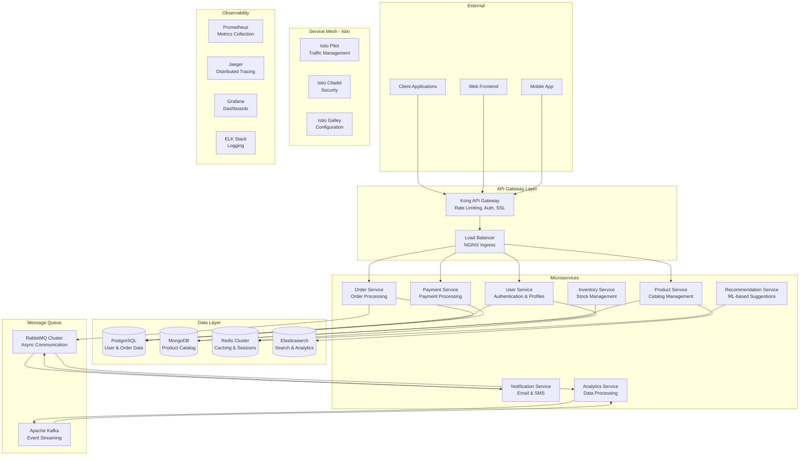

# 🏗️ Enterprise Microservices Platform

<div align="center">


[](https://opensource.org/licenses/Apache-2.0)
[](https://github.com/abhijeet-DevOps7/microservices-platform)
[](https://github.com/abhijeet-DevOps7/microservices-platform)

</div>

## 🎯 Overview

A **production-ready enterprise microservices platform** featuring a complete e-commerce application with service mesh, API gateway, distributed caching, message queues, and comprehensive observability. This platform demonstrates modern microservices architecture patterns and best practices for cloud-native applications.

### 🏆 Platform Features

- **🛍️ Complete E-commerce Application**: User management, product catalog, orders, payments
- **🕸️ Service Mesh Integration**: Istio for traffic management and security
- **🚪 API Gateway**: Kong with rate limiting and authentication
- **⚡ Distributed Caching**: Redis cluster for high performance
- **📨 Message Queues**: RabbitMQ for async communication
- **📊 Full Observability**: Metrics, logging, and tracing integration

## 🏗️ Architecture



## ✨ Microservices

### 🔐 User Service
**Port: 8001** | **Database: PostgreSQL**
- User registration and authentication
- JWT token management
- User profile management
- Password reset functionality

### 📦 Product Service  
**Port: 8002** | **Database: MongoDB**
- Product catalog management
- Category and brand management
- Product search and filtering
- Inventory tracking integration

### 🛒 Order Service
**Port: 8003** | **Database: PostgreSQL**
- Order creation and management
- Order status tracking
- Shopping cart functionality
- Order history and reports

### 💳 Payment Service
**Port: 8004** | **Database: PostgreSQL**
- Payment processing integration
- Multiple payment providers
- Payment history and refunds
- Fraud detection

### 📊 Inventory Service
**Port: 8005** | **Database: MongoDB**
- Real-time stock management
- Low stock alerts
- Supplier integration
- Warehouse management

### 📧 Notification Service
**Port: 8006** | **Message Queue: RabbitMQ**
- Email notifications
- SMS notifications  
- Push notifications
- Notification templates

### 📈 Analytics Service
**Port: 8007** | **Streaming: Kafka**
- Real-time analytics processing
- Customer behavior analysis
- Sales reporting
- Performance metrics

### 🎯 Recommendation Service
**Port: 8008** | **Cache: Redis**
- ML-based product recommendations
- Personalized content
- Trending products
- Cross-sell suggestions

## 🚀 Quick Start

### Prerequisites

```bash
# Required tools
docker --version          # >= 24.0.0
docker-compose --version  # >= 2.20.0
kubectl version --client  # >= 1.28.0
helm version              # >= 3.12.0
istioctl version          # >= 1.19.0
```

### 1. Clone Repository

```bash
git clone https://github.com/abhijeet-DevOps7/microservices-platform.git
cd microservices-platform
```

### 2. Local Development Setup

```bash
# Start all services with Docker Compose
docker-compose up -d

# Wait for services to be ready
./scripts/wait-for-services.sh

# Seed initial data
./scripts/seed-data.sh

# View running services
docker-compose ps
```

### 3. Kubernetes Deployment

```bash
# Deploy to Kubernetes
kubectl apply -f k8s/namespace.yaml
kubectl apply -f k8s/secrets/
kubectl apply -f k8s/configmaps/
kubectl apply -f k8s/services/

# Install Istio service mesh
istioctl install --set values.defaultRevision=default -y
kubectl label namespace microservices istio-injection=enabled

# Deploy Istio configurations
kubectl apply -f istio/

# Verify deployment
kubectl get pods -n microservices
```

### 4. API Gateway Setup

```bash
# Deploy Kong API Gateway
helm repo add kong https://charts.konghq.com
helm install kong kong/kong -n kong --create-namespace \
  --set ingressController.installCRDs=false \
  --set image.repository=kong --set image.tag=3.4

# Configure API routes
kubectl apply -f kong/
```

## 📊 Service Discovery & Communication

### Service Registry
```yaml
# consul/consul-config.yaml
apiVersion: v1
kind: ConfigMap
metadata:
  name: consul-config
data:
  consul.json: |
    {
      "datacenter": "dc1",
      "data_dir": "/consul/data",
      "log_level": "INFO",
      "server": true,
      "ui_config": {
        "enabled": true
      },
      "connect": {
        "enabled": true
      },
      "ports": {
        "grpc": 8502
      },
      "bootstrap_expect": 3
    }
```

### Circuit Breaker Pattern
```yaml
# istio/circuit-breaker.yaml
apiVersion: networking.istio.io/v1beta1
kind: DestinationRule
metadata:
  name: circuit-breaker
spec:
  host: product-service
  trafficPolicy:
    outlierDetection:
      consecutive5xxErrors: 3
      interval: 30s
      baseEjectionTime: 30s
      maxEjectionPercent: 50
    connectionPool:
      tcp:
        maxConnections: 10
      http:
        http1MaxPendingRequests: 10
        maxRequestsPerConnection: 2
        maxRetries: 3
        consecutiveGateway5xxErrors: 3
```

## 🔧 Service Mesh Configuration

### Traffic Management
```yaml
# istio/virtual-service.yaml
apiVersion: networking.istio.io/v1beta1
kind: VirtualService
metadata:
  name: microservices-gateway
spec:
  hosts:
  - api.microservices.local
  gateways:
  - microservices-gateway
  http:
  - match:
    - uri:
        prefix: /api/users
    route:
    - destination:
        host: user-service
        port:
          number: 8001
    fault:
      delay:
        percentage:
          value: 0.1
        fixedDelay: 5s
  - match:
    - uri:
        prefix: /api/products
    route:
    - destination:
        host: product-service
        port:
          number: 8002
    retries:
      attempts: 3
      perTryTimeout: 2s
```

### Security Policies
```yaml
# istio/security-policy.yaml
apiVersion: security.istio.io/v1beta1
kind: PeerAuthentication
metadata:
  name: default
spec:
  mtls:
    mode: STRICT
---
apiVersion: security.istio.io/v1beta1
kind: AuthorizationPolicy
metadata:
  name: user-service-policy
spec:
  selector:
    matchLabels:
      app: user-service
  rules:
  - from:
    - source:
        principals: ["cluster.local/ns/microservices/sa/api-gateway"]
    to:
    - operation:
        methods: ["GET", "POST"]
```

## 📊 Observability Stack

### Distributed Tracing
```yaml
# jaeger/jaeger-deployment.yaml
apiVersion: apps/v1
kind: Deployment
metadata:
  name: jaeger-all-in-one
spec:
  replicas: 1
  selector:
    matchLabels:
      app: jaeger
  template:
    metadata:
      labels:
        app: jaeger
    spec:
      containers:
      - name: jaeger
        image: jaegertracing/all-in-one:1.50
        env:
        - name: COLLECTOR_ZIPKIN_HOST_PORT
          value: "9411"
        - name: SPAN_STORAGE_TYPE
          value: "elasticsearch"
        - name: ES_SERVER_URLS
          value: "http://elasticsearch:9200"
        ports:
        - containerPort: 16686
          name: ui
        - containerPort: 14268
          name: http-collector
        - containerPort: 9411
          name: zipkin
```

### Custom Metrics
```python
# services/user-service/metrics.py
from prometheus_client import Counter, Histogram, Gauge
import time

# Define metrics
REQUEST_COUNT = Counter('user_service_requests_total', 'Total requests', ['method', 'endpoint'])
REQUEST_LATENCY = Histogram('user_service_request_duration_seconds', 'Request latency')
ACTIVE_USERS = Gauge('user_service_active_users', 'Currently active users')
AUTH_FAILURES = Counter('user_service_auth_failures_total', 'Authentication failures')

def track_metrics(func):
    def wrapper(*args, **kwargs):
        start_time = time.time()
        try:
            result = func(*args, **kwargs)
            REQUEST_COUNT.labels(method='POST', endpoint='/login').inc()
            return result
        except Exception as e:
            AUTH_FAILURES.inc()
            raise
        finally:
            REQUEST_LATENCY.observe(time.time() - start_time)
    return wrapper
```

## 🔄 Event-Driven Architecture

### Event Schema Registry
```json
{
  "schemas": [
    {
      "name": "user-created",
      "version": "1.0.0",
      "type": "object",
      "properties": {
        "userId": {"type": "string"},
        "email": {"type": "string"},
        "createdAt": {"type": "string", "format": "date-time"},
        "metadata": {"type": "object"}
      },
      "required": ["userId", "email", "createdAt"]
    },
    {
      "name": "order-placed",
      "version": "1.0.0",
      "type": "object",
      "properties": {
        "orderId": {"type": "string"},
        "userId": {"type": "string"},
        "items": {"type": "array"},
        "totalAmount": {"type": "number"},
        "placedAt": {"type": "string", "format": "date-time"}
      },
      "required": ["orderId", "userId", "totalAmount", "placedAt"]
    }
  ]
}
```

### Event Handlers
```python
# services/notification-service/event_handlers.py
import asyncio
import json
from typing import Dict, Any

class EventHandler:
    def __init__(self, message_queue):
        self.mq = message_queue
        
    async def handle_user_created(self, event: Dict[str, Any]):
        """Handle user creation event"""
        await self.send_welcome_email(
            email=event['email'],
            user_id=event['userId']
        )
        
    async def handle_order_placed(self, event: Dict[str, Any]):
        """Handle order placement event"""
        await self.send_order_confirmation(
            user_id=event['userId'],
            order_id=event['orderId'],
            total_amount=event['totalAmount']
        )
        
    async def handle_payment_failed(self, event: Dict[str, Any]):
        """Handle payment failure event"""
        await self.send_payment_failure_notification(
            user_id=event['userId'],
            order_id=event['orderId'],
            reason=event.get('reason', 'Unknown error')
        )
        
    async def process_events(self):
        """Main event processing loop"""
        handlers = {
            'user-created': self.handle_user_created,
            'order-placed': self.handle_order_placed,
            'payment-failed': self.handle_payment_failed
        }
        
        while True:
            try:
                message = await self.mq.consume()
                event_type = message.get('type')
                
                if event_type in handlers:
                    await handlers[event_type](message['payload'])
                    await self.mq.acknowledge(message)
                else:
                    print(f"Unknown event type: {event_type}")
                    
            except Exception as e:
                print(f"Error processing event: {e}")
                await asyncio.sleep(5)
```

## 📈 Performance & Scaling

### Auto-scaling Configuration
```yaml
# k8s/hpa/user-service-hpa.yaml
apiVersion: autoscaling/v2
kind: HorizontalPodAutoscaler
metadata:
  name: user-service-hpa
spec:
  scaleTargetRef:
    apiVersion: apps/v1
    kind: Deployment
    name: user-service
  minReplicas: 2
  maxReplicas: 20
  metrics:
  - type: Resource
    resource:
      name: cpu
      target:
        type: Utilization
        averageUtilization: 70
  - type: Resource
    resource:
      name: memory
      target:
        type: Utilization
        averageUtilization: 80
  - type: Pods
    pods:
      metric:
        name: http_requests_per_second
      target:
        type: AverageValue
        averageValue: "100"
```

### Caching Strategy
```yaml
# redis/redis-cluster.yaml
apiVersion: apps/v1
kind: StatefulSet
metadata:
  name: redis-cluster
spec:
  serviceName: redis-cluster
  replicas: 6
  selector:
    matchLabels:
      app: redis-cluster
  template:
    metadata:
      labels:
        app: redis-cluster
    spec:
      containers:
      - name: redis
        image: redis:7.2-alpine
        command:
        - redis-server
        - /conf/redis.conf
        - --cluster-enabled yes
        - --cluster-config-file nodes.conf
        - --cluster-node-timeout 5000
        - --appendonly yes
        ports:
        - containerPort: 6379
          name: redis
        - containerPort: 16379
          name: cluster-bus
        volumeMounts:
        - name: redis-config
          mountPath: /conf
        - name: redis-data
          mountPath: /data
      volumes:
      - name: redis-config
        configMap:
          name: redis-config
  volumeClaimTemplates:
  - metadata:
      name: redis-data
    spec:
      accessModes: ["ReadWriteOnce"]
      resources:
        requests:
          storage: 10Gi
```

## 🧪 Testing Strategy

### End-to-End Tests
```python
# tests/e2e/test_user_journey.py
import pytest
import requests
import time
from typing import Dict

class TestUserJourney:
    def setup_method(self):
        self.base_url = "http://api.microservices.local"
        self.test_user = {
            "email": "test@example.com",
            "password": "SecurePass123!",
            "firstName": "Test",
            "lastName": "User"
        }
        
    def test_complete_user_journey(self):
        """Test complete user journey from registration to order"""
        # 1. Register user
        response = requests.post(f"{self.base_url}/api/users/register", json=self.test_user)
        assert response.status_code == 201
        user_id = response.json()["userId"]
        
        # 2. Login user
        login_response = requests.post(f"{self.base_url}/api/users/login", json={
            "email": self.test_user["email"],
            "password": self.test_user["password"]
        })
        assert login_response.status_code == 200
        token = login_response.json()["token"]
        headers = {"Authorization": f"Bearer {token}"}
        
        # 3. Browse products
        products_response = requests.get(f"{self.base_url}/api/products", headers=headers)
        assert products_response.status_code == 200
        products = products_response.json()["products"]
        assert len(products) > 0
        
        # 4. Add items to cart
        cart_response = requests.post(f"{self.base_url}/api/orders/cart", 
            json={"productId": products[0]["id"], "quantity": 2}, headers=headers)
        assert cart_response.status_code == 200
        
        # 5. Place order
        order_response = requests.post(f"{self.base_url}/api/orders", headers=headers)
        assert order_response.status_code == 201
        order_id = order_response.json()["orderId"]
        
        # 6. Process payment
        payment_response = requests.post(f"{self.base_url}/api/payments", json={
            "orderId": order_id,
            "paymentMethod": "credit_card",
            "amount": order_response.json()["totalAmount"]
        }, headers=headers)
        assert payment_response.status_code == 200
        
        # 7. Verify order status
        time.sleep(2)  # Wait for async processing
        status_response = requests.get(f"{self.base_url}/api/orders/{order_id}", headers=headers)
        assert status_response.status_code == 200
        assert status_response.json()["status"] == "confirmed"
```

## 🚀 Deployment & Operations

### GitOps Integration
```yaml
# argocd/microservices-app.yaml
apiVersion: argoproj.io/v1alpha1
kind: Application
metadata:
  name: microservices-platform
  namespace: argocd
spec:
  project: default
  source:
    repoURL: https://github.com/abhijeet-DevOps7/microservices-platform
    targetRevision: main
    path: k8s
    directory:
      recurse: true
  destination:
    server: https://kubernetes.default.svc
    namespace: microservices
  syncPolicy:
    automated:
      prune: true
      selfHeal: true
    syncOptions:
    - CreateNamespace=true
    retry:
      limit: 5
      backoff:
        duration: 5s
        factor: 2
        maxDuration: 3m
```

### Disaster Recovery
```yaml
# backup/velero-backup.yaml
apiVersion: velero.io/v1
kind: Backup
metadata:
  name: microservices-platform-backup
spec:
  includedNamespaces:
  - microservices
  - istio-system
  - kong
  includedResources:
  - deployments
  - services
  - configmaps
  - secrets
  - persistentvolumeclaims
  excludedResources:
  - events
  - logs
  storageLocation: aws-s3
  ttl: 720h0m0s  # 30 days
  schedule: "0 2 * * *"  # Daily at 2 AM
```

## 🤝 Contributing

We welcome contributions! Please see our [Contributing Guide](CONTRIBUTING.md) for details.

### Development Setup
1. Fork the repository
2. Create a feature branch
3. Set up local development environment
4. Make your changes and add tests
5. Submit a pull request

## 📄 License

This project is licensed under the Apache License 2.0 - see the [LICENSE](LICENSE) file for details.

---

<div align="center">

### 🌟 **"Microservices done right - scalable, observable, and secure"** 🌟

**⭐ Star this repository if you find it useful!**

**Built with ❤️ by [Abhijeet DevOps](https://github.com/abhijeet-DevOps7)**


</div>